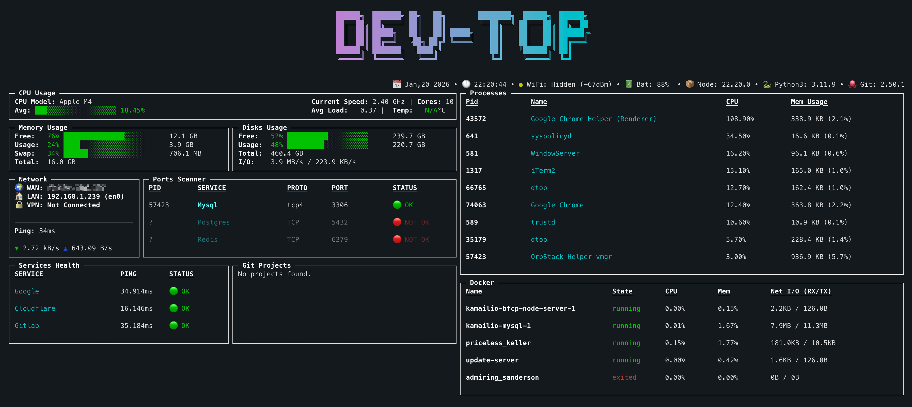

# dtop

> A developer-focused terminal dashboard for monitoring system status, Docker, Git, and more.



[](https://badge.fury.io/js/dtop)

## Features

- **System Monitoring**: Real-time CPU, Memory, Disk, and Network usage.
- **Docker Integration**: View running containers and their status.
- **Process Manager**: View top CPU-consuming processes.
- **Git Monitor**: Track recent changes in your projects.
- **Service Health**: Monitor the status of local or remote services (HTTP/TCP).
- **Customizable**: Configure refresh intervals, themes, and modules via `config.yml`.

## Supported Operating Systems

- **Linux**: Fully supported.
- **macOS**: Fully supported (includes CPU temperature monitoring).
- **Windows**: Supported via WSL (Windows Subsystem for Linux).

## Install

```bash
npm install --global dtop
```

## Usage

```bash
dtop
```

## Keyboard Shortcuts

- `d`: Toggle focus on **Docker** block.
- `s`: Toggle focus on **Services Health** block.
- `p`: Toggle focus on **Ports Scanner** block.
- `r`: Toggle focus on **Git Projects** block.
- `↑`/`↓`: Navigate through the **Processes** list or scroll within a focused block.
- `PageUp`/`PageDown`: Scroll by page in a focused block.
- `g`: Jump to the top of the **Processes** list.
- `G`: Jump to the bottom of the **Processes** list.
- `Ctrl+c`: Quit the application.

## Configuration

`dtop` searches for a `config.yml` file in the standard user configuration directory:

- `~/.config/dtop/config.yml`

To generate a default configuration file, run:

```bash
dtop init
```

### Configuration Attributes

The following attributes are available in `config.yml`. All `refreshInterval` values are in **milliseconds**.

#### `statusBar`

Configures the information displayed in the bottom status bar.

- `refreshInterval`: Refresh rate for the status bar data.
- `location.enabled`: Show/hide geographic location (based on IP).
- `date.enabled`: Show/hide current date.
- `time.enabled`: Show/hide current time.
- `time.format`: Time format string (e.g., `'HH:mm:ss'`).
- `wifi.enabled`: Show/hide WiFi signal strength (macOS/Linux).
- `battery.enabled`: Show/hide battery status.
- `node.enabled`: Show/hide Node.js version.
- `python3.enabled`: Show/hide Python 3 version.
- `git.enabled`: Show/hide global Git status.

#### `cpu`

- `refreshInterval`: Refresh rate for CPU usage and temperature.

#### `memory`

- `refreshInterval`: Refresh rate for memory usage.

#### `disks`

- `refreshInterval`: Refresh rate for disk space usage.

#### `network`

- `refreshInterval`: Refresh rate for transfer speeds (Up/Down) and local IP.
- `public_ip.refreshInterval`: Frequency of fetching the public IP address.

#### `portScanner`

- `refreshInterval`: Frequency of port availability checks.
- `list`: A list of services to scan:
  - `name`: Display name for the service.
  - `port`: TCP port number to check.

#### `services`

- `refreshInterval`: Frequency of health checks.
- `list`: A list of hosts to monitor:
  - `name`: Display name for the service.
  - `host`: IP address or URL (e.g., `8.8.8.8` or `https://google.com`).

#### `projects`

- `refreshInterval`: Refresh rate for Git status monitoring in projects.
- `list`: A list of absolute paths to local Git repositories.

#### `docker`

- `refreshInterval`: Refresh rate for Docker container status.

#### `processes`

- `refreshInterval`: Refresh rate for the top processes list.

#### `theme`

Customizes the interface colors. Supports standard CSS color names or Hex codes.

- `primary`, `secondary`, `success`, `warning`, `error`, `text`.

### Example `config.yml`

```yaml
statusBar:
  refreshInterval: 4000
  time:
    enabled: true
    format: 'HH:mm:ss'
  git:
    enabled: true

cpu:
  refreshInterval: 2000

services:
  refreshInterval: 5000
  list:
    - name: Google
      host: 8.8.8.8
    - name: API
      host: https://api.example.com

theme:
  primary: 'blue'
  secondary: 'cyan'
```

## Contributing

Contributions are welcome! If you have any ideas, suggestions, or bug reports, please open an issue or submit a pull request.

## License

MIT
